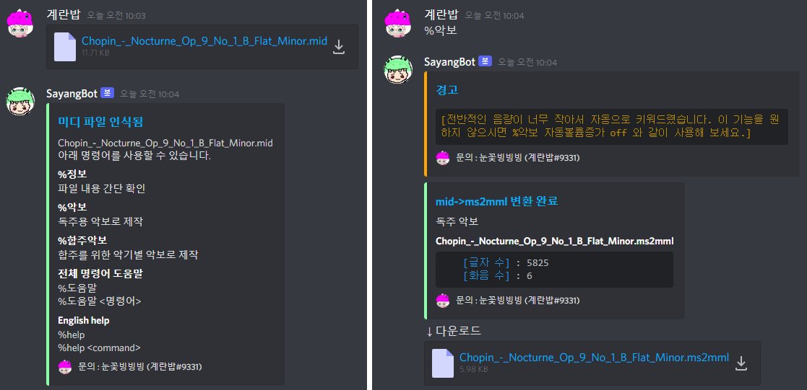
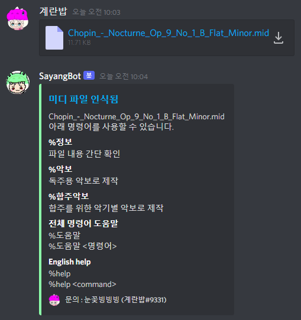
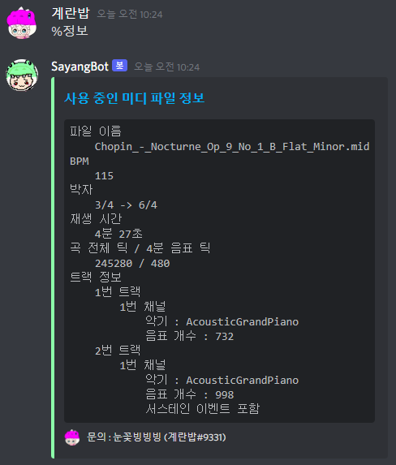
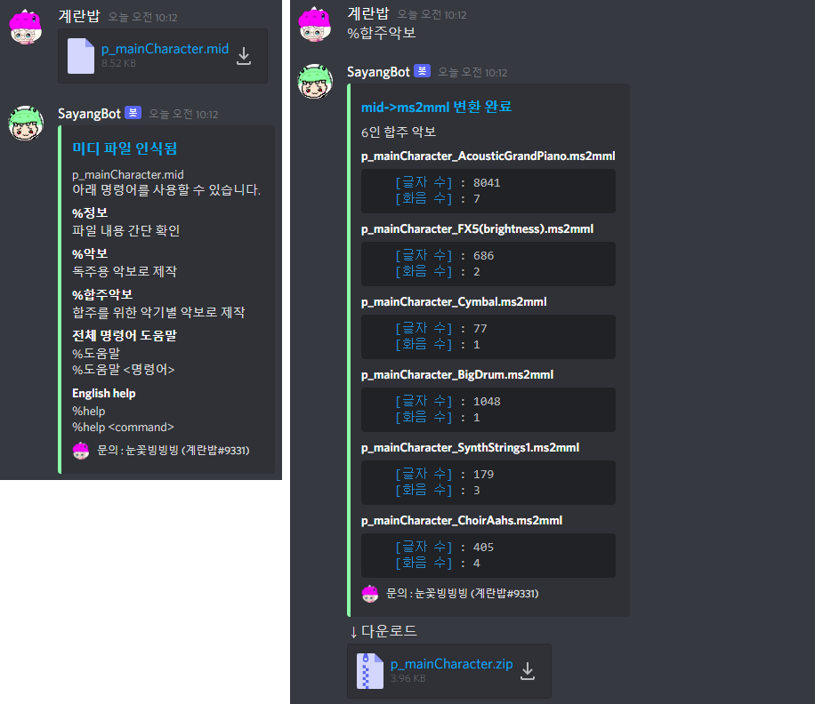

# SayangBot

  
메이플스토리2 악보를 간편하게 만들 수 있는 프로그램 (Discord 봇) 입니다.  
미디 파일을 메이플스토리2 악보로 즉시 바꾸어 줍니다.  
메이플 월드의 새로운 음악가가 되어 보세요!  
This is a Discord bot that allows you to easily create MapleStory 2 sheet music.  
This bot instantly converts MIDI files into MapleStory 2 sheet music.  
Become a new musician in Maple World!  

# 설치 / Setup

## Discord 계정 준비 / Prepare your Discord account

https://discord.com/  
이 프로그램은 Discord에서 작동합니다. 편리한 게임 메신저인 Discord에 지금 바로 로그인하세요!  
This program works with Discord. Log in to Discord, a convenient game messenger right now!

## Discord 서버 준비 / Prepare your Discord server

SayangBot을 초대할 서버가 있어야 합니다. 없으시더라도 Discord에서 10초면 만들 수 있습니다.  
You must have a server to invite SayangBot to. Even if you don't have one, you can create one on Discord in 10 seconds.  

## SayangBot 초대하기 / Invite SayangBot

https://discord.com/oauth2/authorize?client_id=886956440361791499&permissions=0&scope=bot  
↑ 이 링크를 누르시면 SayangBot을 서버에 초대할 수 있습니다.  
↑ Click this link to invite SayangBot to the server.

## 설치 완료! / Installation is complete

  
이제부터 SayangBot이 음악가님을 위해 악보를 만들어 줄 것입니다.  
From now on, SayangBot will create sheet music for you.

# 사용법 / How to use

## 미디 파일 준비 / Prepare MIDI file

만들고자 하는 음악의 MIDI 파일이 있어야 합니다.  
MIDI 파일은 직접 만들 수도 있지만, 유명한 곡일 경우 다른 사람이 만들어둔 것을 인터넷 검색으로 찾을 수 있습니다.  
Google 등으로 <곡 이름> midi 와 같이 검색하거나, Musescore 등의 전문 사이트에서 MIDI 파일을 찾아 보세요.  
You must have a MIDI file of the music you want to create.  
You can also create your own MIDI files, but if they're famous songs, you can search the internet for others made by others.  
Search for MIDI on Google, etc., or find it on specialized sites such as Musescore.

## 미디 파일 업로드 / Upload MIDI file

  
SayangBot이 있는 Discord 서버에 미디 파일을 올리시면, SayangBot이 자동으로 인식하여 작동을 준비합니다.  
Just upload your MIDI file to the Discord server with SayangBot, and SayangBot will automatically recognize it and prepare to operate.

## 미디 파일 내용 확인 / Check MIDI file contents

  
Discord 채팅으로 %정보 라고 입력해 보세요.  
미디 파일의 BPM, 재생 시간, 사용 악기, 텍스트 메모 등을 간단히 확인할 수 있습니다.  
Try entering %info in Discord chat.  
You can easily check a MIDI file's BPM, duration, instrument used, text notes, and more.

## 악보 작성 (독주) / Converting into sheet music (solo)

  
Discord 채팅으로 %악보 라고 입력해 보세요.  
혼자 연주할 수 있는 악보가 제작됩니다.  
Try typing %solo in Discord chat.  
A sheet music that can be played alone is produced.

## 악보 작성 (합주) / Converting into sheet music (ensemble)

  
Discord 채팅으로 %합주악보 라고 입력해 보세요.  
파티원들과 합주를 할 수 있도록 악기별 악보가 따로따로 제작됩니다.  
Try typing %ensemble in Discord chat.  
Sheet music for each instrument is produced separately so that you can perform with party members.

## 악보 사용법 / How to use sheet music

  
빈 악보를 더블클릭하여 악보 제작 화면을 열고, 우측 하단의 파일 불러오기 버튼으로 방금 만들어진 ms2mml 파일을 가져옵니다.  
Double-click the blank sheet to open the sheet music creation screen, and import the just created ms2mml file by clicking the "파일 불러오기" button at the bottom right.

## 옵션 사용법 / How to use option for conversion

%도움말 악보 를 입력하여 옵션 목록과 사용법을 참고해 보세요.  
Enter %Help Score to see a list of options and how to use them.

# 문제 해결 및 팁 / Troubleshooting and Tips

## 봇이 응답하지 않는 경우 / If the bot is not responding

개발자가 8시간 이내로 봇을 재부팅할 것이니 기다려 주십시오.  
그리고 봇이 사망한 원인을 1~2일 내로 해결하여 업데이트할 것입니다.  
Please be patient as the developer will reboot the bot within 8 hours.  
And developer will update the cause of the bot's death by addressing it within 1-2 days.

## 변환에 실패할 경우 / If the conversion fails

개발자가 1~2일 내로 패치할 것이니 기다려 주십시오.  
SayangBot은 2021.9.24부터 베타 테스트 중이며 오늘도 개발자가 지속적으로 오류를 수정하고 기능을 개선하고 있습니다. 현재 대부분의 MIDI 파일을 오류 없이 악보로 변환 가능한 것으로 여겨지고 있으나, 간혹 예상치 못한 원인으로 처리가 안 될 수 있습니다. 이때는 이미 개발자에게 자동으로 관련 정보가 전송되었을 것이며, 원인을 파악한 뒤 해당 파일도 처리가 가능하도록 패치할 것입니다.  
Developers will patch it in 1-2 days. So please wait.  
SayangBot is in beta testing starting on September 24, 2021, and today, developers are constantly fixing errors and improving features. Currently, it is considered that most MIDI files can be converted into sheet music without errors, but sometimes, processing may not be possible due to unexpected reasons. In this case, the relevant information has already been sent to the developer automatically, and after determining the cause, developers will patch the file so that it can be processed.

## 글자 수 줄이기 / How to reduce the number of characters

- %악보 해상도 5 등으로 해상도를 낮추어 보세요. 해상도가 낮을수록 글자 수가 줄어들지만 악보의 품질이 낮아집니다. 해상도는 0~6의 정수로 입력할 수 있으며, 입력하지 않을 경우의 기본값은 6입니다.
- %악보 템포뭉개기 3 등으로 템포 변환 이벤트의 개수를 줄여 보세요. 템포뭉개기가 높을수록 글자 수가 줄어들지만 악보의 품질이 낮아집니다. 템포뭉개기는 0~6의 정수로 입력할 수 있으며, 입력하지 않을 경우의 기본값은 0입니다.
- 서스테인 페달 이벤트가 포함된 악보일 경우, %악보 서스테인뭉개기 3 등으로 서스테인 이벤트의 개수를 줄여 보세요. 서스테인뭉개기가 높을수록 글자 수가 줄어들지만 악보의 품질이 낮아집니다. 서스테인뭉개기는 0~6의 정수로 입력할 수 있으며, 입력하지 않을 경우의 기본값은 0입니다.
- 셋잇단음표가 많이 등장하거나 스윙 리듬이 있는 곡의 경우, %악보 셋잇단 등과 같이 사용하면 글자수가 줄어들 수도 있습니다.
> 위 옵션은 모두 중복해서 사용 가능합니다. (예시 : %악보 셋잇단 해상도 4 템포뭉개기 6 서스테인뭉개기 6)

# 피드백 보내기 / Feedback

SayangBot이 있는 Discord 서버에서 %피드백 <하실 말씀> 을 입력하면 개발자에게 전송됩니다.  
혹은 Discord에서 계란밥#9331 으로 연락주셔도 괜찮습니다.  
자유롭게 적어서 보내주시면 개발에 큰 도움이 됩니다. 감사합니다.  
Enter %feedback "what you want to say" on the Discord server with SayangBot and it will be sent to the developer.  
Or you can contact me on Discord (계란밥#9331).  
It will be a great help for development. thank you.

# 업데이트 내역

## 2022/2/2
- 1만자 제한에 맞게 분할하는 과정에서 원본 음표 길이가 수정되어 악보에 출력되지 않는 오류를 수정 (2d array는 slice 해도 deepcopy가 안됨?!)
- 최고음 옵션 수치가 셈여림으로 연결되는 오류를 수정

## 2021/12/15
- 템포 32 미만 혹은 255 초과인 구간이 제대로 출력되지 않는 오류를 수정

## 2021/11/26
- 11/7 업데이트 내용 중 템포 관련 내용이 셋잇단 옵션에 적용되지 않는 오류를 수정
- 이름이 mid인 파일을 보내면 서버가 사망하는 오류를 수정
- 서버가 사망하더라도 새로운 서버가 가동될 수 있도록 실행 방식을 변경 (코드에는 나와있지 않음)

## 2021/11/7
- 템포가 32 미만 혹은 255를 초과하는 MIDI 파일을 처리할 때, 템포 변경 이벤트가 나타나지 않는 시점까지의 음표들이 잘못된 길이로 처리되는 오류를 수정
- AnyConv에서 생성한 MIDI 파일에 대한 안내 메시지를 추가
- 모션 출력 시 기본 모션 (m1) 만 출력되던 것을 랜덤한 모션 (m1~m5) 으로 지정하여 출력하도록 변경

## 2021/10/9
- 플룻과 색소폰의 악기 이름이 잘못 출력되는 오류를 수정
- 독주악보가 여러 장 나왔을 경우 화음분할에 대한 도움말을 추가
- help 명령어로 영어 도움말 요청 시 한국어 도움말을 보는 방법 설명을 추가
- 하이퍼링크 유튜브 스팸 갖다버리고 여기 도움말로 연결

## 2021/10/6

- 2개 이상의 포트 (17개 이상의 채널) 를 사용하는 대규모 MIDI 파일 처리 시 잘못된 악기가 배정되는 오류를 수정

# 업데이트 목표 사항
- musescore의 소스 코드를 참고하여 셋잇단음표 등의 강건하고 정밀한 음표 인식
- MIDI 파일 처리 부분을 javascript 대신 C++ 등으로 대체하여 처리 속도 대폭 향상
- 서스테인 이벤트를 기존 화음에 통합하고 템포 변환 전후에도 음표가 끊어지지 않도록 수정
- 언제 될지 모름
- 영원히 안 될 수도 있음
- 지금상태로도 문제가 없으니 아마 안 할 예정
- 누군가 해주세요
- 역시 C언어 ** 빠름
